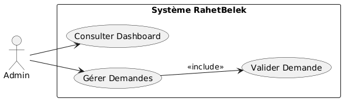
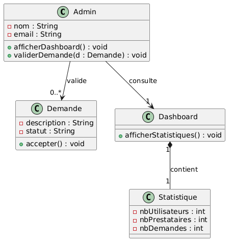
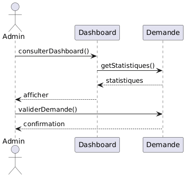

# RahetBelek

## Pitch
Des milliers de Tunisiens vivent à l’étranger, ils ont réussi ailleurs mais vivent avec une inquiétude constante.
Cette plateforme permet aux familles expatriées d’assurer la sécurité et le confort de leurs parents en Tunisie grâce à un service simple et efficace.

---

## Description
Plateforme pour aider les familles à distance à gérer les besoins de leurs parents en Tunisie.

---

## Équipe Scrum (Groupe)
- Maram Jaouadi — Product Owner + Dev — Gestion des demandes  
- Islem Talmoudhi — Scrum Master + Dev — Gestion des prestataires  
- Razan Salem — Dev — Gestion des missions  
- Sara Ayari — Dev — Paiement sécurisé  
- Hajer Saidi — Dev — Administration (dashboard + gestion)  

---

## Acteurs du système
- Expatrié (Client)  
- Prestataire  
- Administrateur  

---

## Fonctionnalités principales
1. Publier une demande  
2. Gérer les prestataires  
3. Accepter et suivre une mission  
4. Paiement sécurisé  
5. Administration  

---

## 👤 Fonctionnalité Admin
- Dashboard avec statistiques  
- Gestion des demandes  
- Validation des demandes  

---

## 🎨 Design (Figma)
https://www.figma.com/make/sc0JEQSFUUDMeyo5D2G0yE/Design-admin-dashboard-UI

---

## ⚙️ Technologies
- Java  
- GitHub  
- Figma  

---

## 📊 UML Diagrams

### Use Case Diagram

### Class Diagram

### Sequence Diagram
